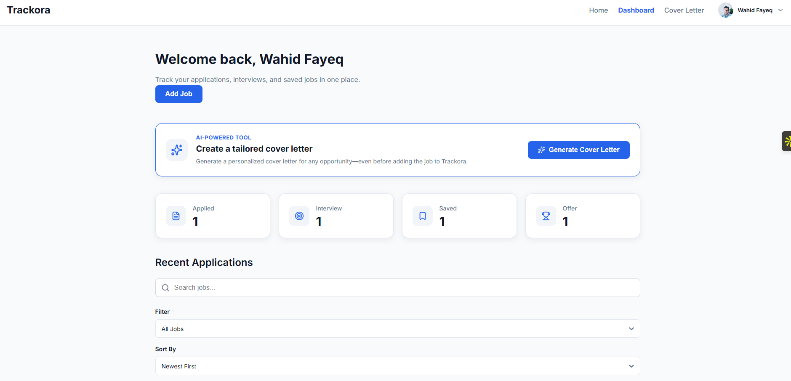
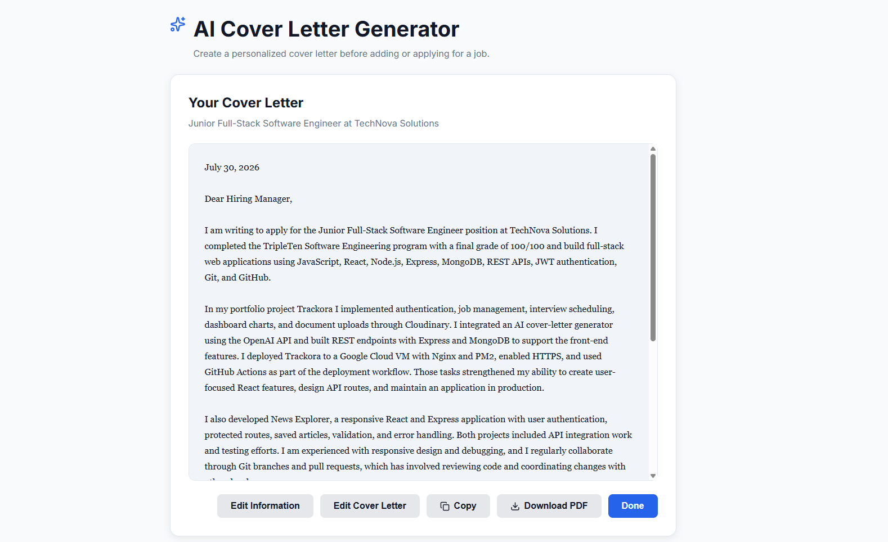
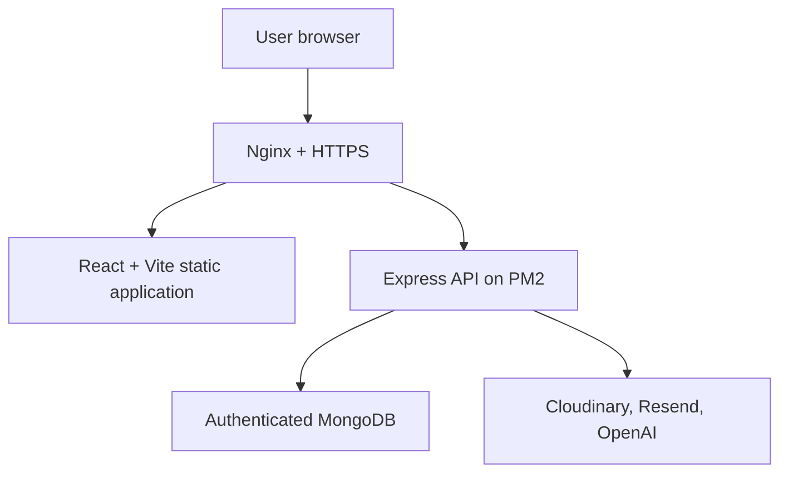

# Trackora

An AI-powered, full-stack job application tracker for organizing applications, interviews, documents, and cover letters in one place.


## Table of contents

- [Live application](#live-application)
- [Demo](#demo)
- [Screenshots](#screenshots)
- [Overview](#overview)
- [Features](#features)
- [Architecture](#architecture)
- [Technology stack](#technology-stack)
- [Project structure](#project-structure)
- [Getting started](#getting-started)
- [Environment variables](#environment-variables)
- [Running locally](#running-locally)
- [Available scripts](#available-scripts)
- [API overview](#api-overview)
- [Testing and quality checks](#testing-and-quality-checks)
- [Deployment](#deployment)
- [Security practices](#security-practices)
- [Future improvements](#future-improvements)
- [Author](#author)
- [License](#license)

## Live application

- **Application:** [https://trackora.newsexplorer.xyz](https://trackora.newsexplorer.xyz)
- **API health:** [https://api.trackora.newsexplorer.xyz/health](https://api.trackora.newsexplorer.xyz/health)

Visitors using `www.trackora.newsexplorer.xyz` are automatically redirected to the main Trackora website.

## Demo

A short video walkthrough of Trackora will be added soon.

## Screenshots

### Dashboard



### AI cover-letter generator



## Overview

Trackora helps job seekers manage the complete application process. Users can securely create an account, organize job opportunities, track application statuses, schedule interviews, upload supporting documents, view progress charts, and generate accurate, fact-based cover letters with AI.

The project demonstrates full-stack JavaScript development, REST API design, authentication, file uploads, third-party API integration, responsive UI design, automated testing, Linux server administration, and continuous deployment.

## Features

### Authentication and account management

- Registration and login using email or username
- Password hashing with bcrypt
- JWT-based authentication and protected routes
- Persistent login sessions
- Forgot-password and reset-password flow using Resend
- Editable profile name and avatar
- Cloudinary avatar uploads
- Password-change interface
- User preferences for appearance, sorting, date format, and default job status

### Job application tracking

- Create, view, edit, and delete job applications
- Track application statuses:
  - Applied
  - Interview
  - Saved
  - Offer
  - Rejected
- Search, filter, and sort applications
- Configure default status and display preferences
- Record company, position, location, job description, and application details
- Responsive job cards and detailed application views
- Empty, loading, validation, and error states

### Interviews and analytics

- Store interview date, time, type, location, meeting link, and notes
- Track application totals by status
- View application progress and monthly activity charts
- Calculate rejection rate
- Display dashboard summaries and recent applications

### Documents

- Upload resumes, cover letters, and supporting documents
- Store files securely through Cloudinary
- Associate documents with individual job applications
- View and delete uploaded documents

### AI cover-letter generator

- Generate customized cover letters using the OpenAI API
- Use the job description and candidate-provided experience
- Apply strict accuracy rules that prevent invented qualifications
- Edit generated letters
- Copy letters to the clipboard
- Download letters as PDF
- Save cover letters and job-description context

### User experience

- Responsive desktop, tablet, and mobile layouts
- Light and dark themes
- Lazy-loaded pages
- Protected and public route guards
- Toast notifications
- Accessible reusable form components
- Custom 404 page
- Loading indicators and clear validation feedback

## Architecture



## Technology stack

| Area           | Technologies                                              |
| -------------- | --------------------------------------------------------- |
| Frontend       | React 19, Vite, React Router, Context API, CSS            |
| UI             | Lucide React, React Icons, React Select, React Datepicker |
| Charts         | Recharts                                                  |
| PDF generation | jsPDF                                                     |
| Backend        | Node.js, Express                                          |
| Database       | MongoDB, Mongoose                                         |
| Authentication | JWT, bcryptjs                                             |
| Validation     | Joi, validator                                            |
| File storage   | Cloudinary, Multer                                        |
| Email          | [Resend](https://resend.com/docs)                         |
| AI             | [OpenAI Responses API](https://platform.openai.com/docs)  |
| Testing        | Vitest, Testing Library, Node test runner, Supertest      |
| Code quality   | Oxlint, ESLint, jscpd                                     |
| Deployment     | Google Cloud VM, Ubuntu, PM2, Nginx, Certbot              |
| CI/CD          | GitHub Actions                                            |

## Project structure

```text
trackora/
├── .github/
│   └── workflows/
│       └── deploy.yml
├── client/
│   ├── public/
│   ├── src/
│   │   ├── components/
│   │   ├── config/
│   │   ├── context/
│   │   ├── hooks/
│   │   ├── pages/
│   │   ├── providers/
│   │   ├── services/
│   │   └── utils/
│   ├── .env.example
│   └── package.json
├── server/
│   ├── config/
│   ├── controllers/
│   ├── middleware/
│   ├── models/
│   ├── routes/
│   ├── services/
│   ├── tests/
│   ├── .env.example
│   ├── app.js
│   └── package.json
├── LICENSE
└── README.md
```

## Getting started

### Prerequisites

Install:

- Node.js 20.19 or later
- npm
- Git
- MongoDB, either locally or through a hosted connection
- Accounts and API credentials for any third-party features you want to use:
  - Cloudinary
  - Resend
  - OpenAI

### Installation

Clone the repository and switch to the development branch:

```bash
git clone https://github.com/Wahid2025-Fayeq/trackora.git
cd trackora
git switch develop
```

Install the frontend and backend dependencies:

```bash
cd client
npm ci

cd ../server
npm ci
```

## Environment variables

Never commit real credentials. Copy each example file and provide your own values.

### Client

Create `client/.env`:

```env
VITE_API_URL=http://localhost:3001
```

For production, `client/.env.production` sets `VITE_API_URL` to the deployed API origin (`https://api.trackora.newsexplorer.xyz`) instead of localhost. This file lives only on the VM and is never committed.

### Server

Create `server/.env`:

```env
PORT=3001
NODE_ENV=development

MONGODB_URI=mongodb://127.0.0.1:27017/trackora
JWT_SECRET=replace_with_a_long_random_secret

CLOUDINARY_CLOUD_NAME=your_cloud_name
CLOUDINARY_API_KEY=your_cloudinary_api_key
CLOUDINARY_API_SECRET=your_cloudinary_api_secret

RESEND_API_KEY=your_resend_api_key
RESEND_FROM_EMAIL="Trackora <onboarding@resend.dev>"

OPENAI_API_KEY=your_openai_api_key
OPENAI_MODEL=gpt-5-mini

CLIENT_URL=http://localhost:3000
```

Generate a strong local JWT secret with:

```bash
openssl rand -hex 64
```

## Running locally

Start the backend:

```bash
cd server
npm run dev
```

Start the frontend in a second terminal:

```bash
cd client
npm run dev
```

The default local addresses are:

- Frontend: `http://localhost:3000`
- Backend: `http://localhost:3001`
- Health check: `http://localhost:3001/health`

> **Note:** Production runs the backend on port `3002` instead of `3001`, since Nginx sits in front of it and handles the public-facing HTTPS port. This has no effect on local development.

## Available scripts

### Client

| Command              | Purpose                             |
| -------------------- | ----------------------------------- |
| `npm run dev`        | Start the Vite development server   |
| `npm run build`      | Create the production bundle        |
| `npm run preview`    | Preview the production bundle       |
| `npm run lint`       | Run Oxlint                          |
| `npm test`           | Run Vitest tests                    |
| `npm run duplicates` | Check source duplication with jscpd |

### Server

| Command        | Purpose                       |
| -------------- | ----------------------------- |
| `npm start`    | Start the Express server      |
| `npm run dev`  | Start the server with Nodemon |
| `npm run lint` | Run ESLint                    |
| `npm test`     | Run the Node test suite       |

## API overview

| Area           | Base route | Purpose                                               |
| -------------- | ---------- | ----------------------------------------------------- |
| Health         | `/health`  | Check API availability                                |
| Authentication | `/auth`    | Registration, login, and password reset               |
| Users          | `/users`   | Profile, preferences, password, and avatar management |
| Jobs           | `/jobs`    | Applications, interviews, and documents               |
| AI             | `/api/ai`  | AI cover-letter generation                            |

Protected endpoints require a JWT in the authorization header:

```text
Authorization: Bearer <token>
```

## Testing and quality checks

Run the complete local verification (lint, test, and build) for both the client and server:

```bash
cd client
npm ci
npm run lint
npm test
npm run build

cd ../server
npm ci
npm run lint
npm test
```

The test suites cover route guards, authentication state, reusable inputs, application health, CORS behavior, and backend package expectations.

## Deployment

Trackora is deployed on a Google Cloud Compute Engine VM running Ubuntu.

### Production configuration

- Frontend source: `~/trackora/client`
- Published frontend: `~/trackora-live`
- Backend source: `~/trackora/server`
- Backend port: `3002`
- PM2 process: `trackora-backend`
- Reverse proxy: Nginx
- TLS certificates: Let's Encrypt through Certbot
- Database: authenticated MongoDB on the VM
- Uploaded files: Cloudinary

Production environment files remain only on the VM:

- `server/.env`
- `client/.env.production`

### Continuous deployment

A push to `develop` triggers `.github/workflows/deploy.yml`.

The workflow:

1. Installs dependencies with `npm ci`.
2. Runs frontend and backend linting.
3. Runs frontend and backend tests.
4. Builds the frontend with the production API URL.
5. Connects to the VM using a dedicated deployment key.
6. Fast-forwards the VM repository from `origin/develop`.
7. Installs production backend dependencies.
8. Restarts and saves the PM2 process.
9. Verifies the local backend health endpoint.
10. Builds and publishes the frontend.
11. Verifies the public frontend and API.

Required GitHub repository secrets:

| Secret                   | Purpose                                         |
| ------------------------ | ----------------------------------------------- |
| `VM_HOST`                | Google Cloud VM external IP                     |
| `VM_USER`                | VM deployment username                          |
| `VM_SSH_PRIVATE_KEY_B64` | Base64-encoded dedicated deployment private key |
| `VM_SSH_KNOWN_HOSTS`     | Verified SSH host-key entries                   |

## Security practices

- Passwords are hashed and never stored as plaintext.
- JWT secrets and API credentials are stored in environment files.
- Production environment files are excluded from Git.
- Protected endpoints validate authentication.
- Job and document operations enforce resource ownership.
- CORS permits only the production frontend origin.
- MongoDB requires authentication.
- Nginx provides HTTPS and HTTP-to-HTTPS redirects.
- GitHub Actions uses a dedicated SSH deployment key.
- Deployment uses fast-forward-only Git updates.
- Uploaded files are handled through Cloudinary.

## Future improvements

- Automated follow-up reminders
- Application tags and priority labels
- Kanban-style application pipeline
- Expanded integration and end-to-end tests
- Automated deployment rollback
- Monitoring and alerting

## Author

**Wahid Fayeq**

- GitHub: [Wahid2025-Fayeq](https://github.com/Wahid2025-Fayeq)

## License

Licensed under the MIT License — see [LICENSE](LICENSE) for details.
